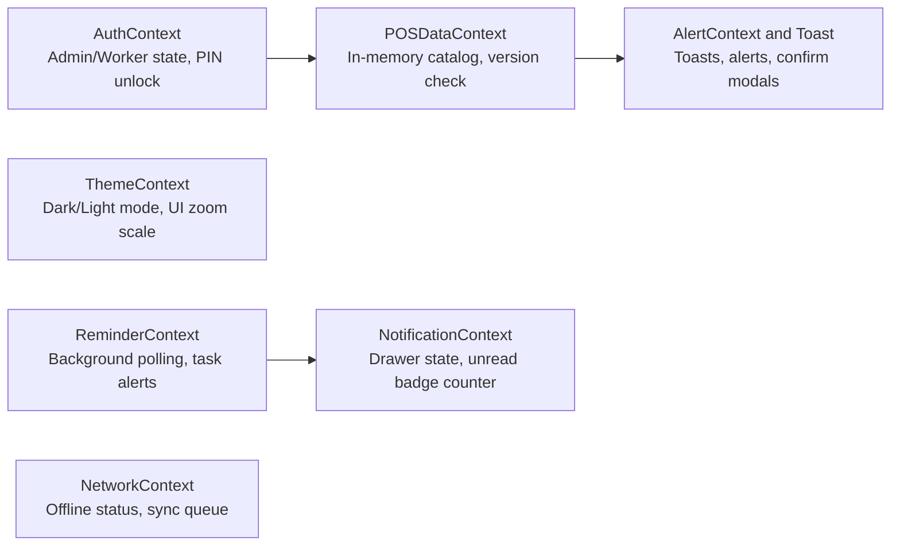
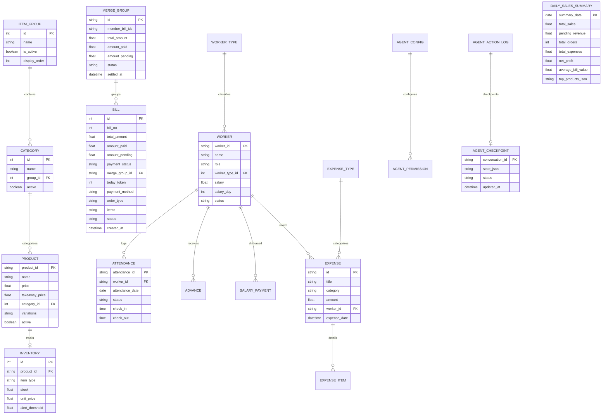
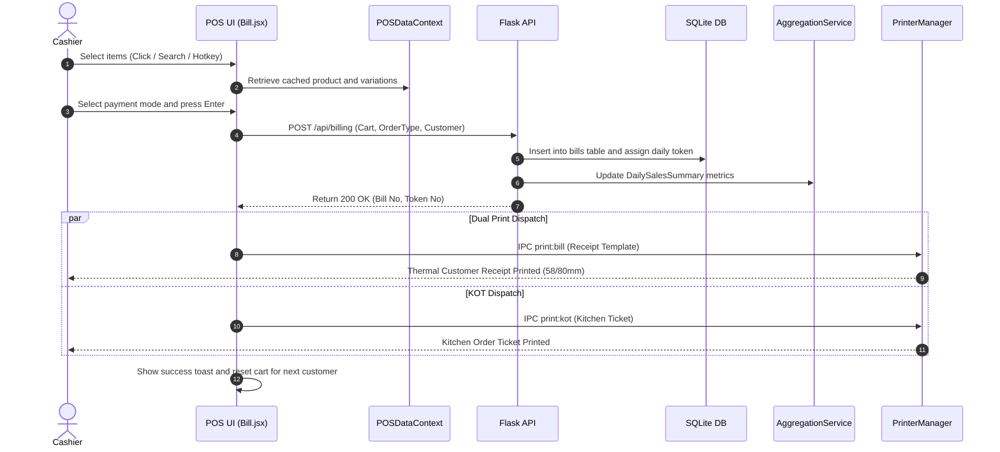
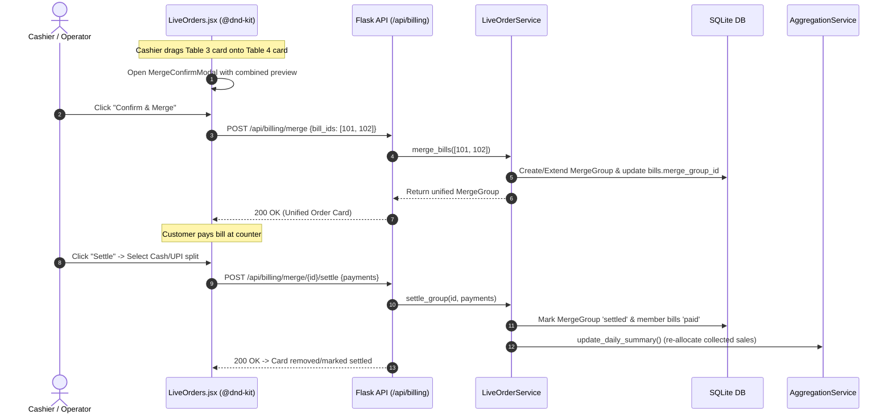
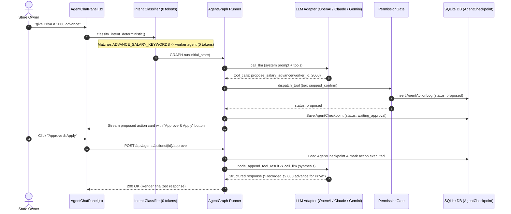
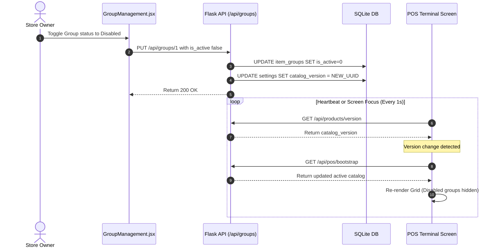
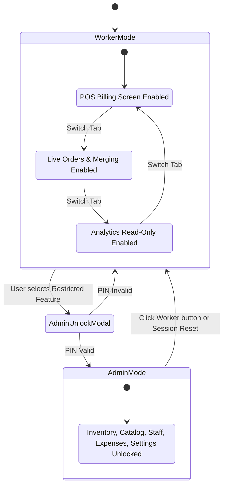
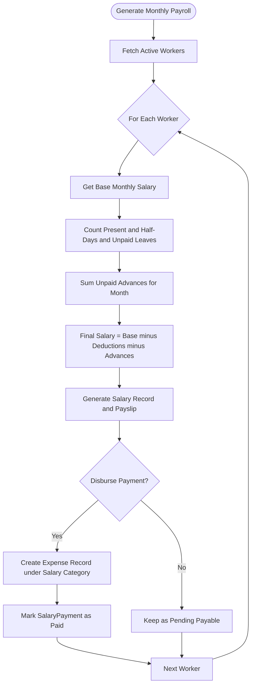
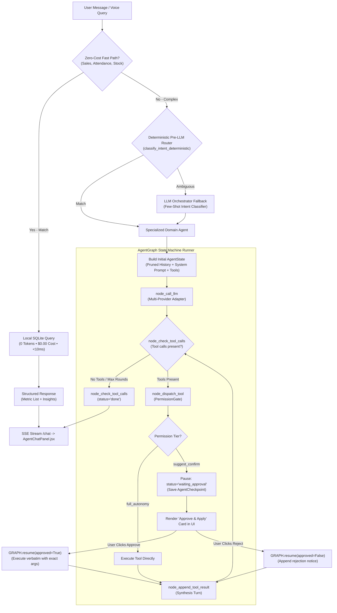

# InfoOS Desktop - Next-Generation Offline POS & Enterprise Store Management

[](package.json)
[](electron/main.js)
[](package.json)
[](electron/assets/license.txt)

> **InfoOS Desktop** is a zero-latency, 100% offline-first Point of Sale (POS) and comprehensive retail/restaurant operations suite built for high-throughput billing, inventory control, automated staff payroll, daily expense tracking, and real-time sales analytics.

---

## ⚡ 10-Second Executive Summary

```
┌─────────────────────────────────────────────────────────────────────────────────────────┐
│                                     INFOOS AT A GLANCE                                  │
├──────────────────────────┬───────────────────────────┬──────────────────────────────────┤
│ 🛒 High-Speed POS        │ ⚡ Live Orders & Merging  │ 📊 Analytics & BI                │
│ • Sub-second checkout    │ • Drag-to-Merge billing   │ • Pre-aggregated instant stats   │
│ • ESC/POS 58/80mm print  │ • Split / Settle payments │ • Real-time revenue & net profit │
│ • KOT kitchen routing    │ • Un-merge audit trail    │ • Pending revenue separation     │
├──────────────────────────┼───────────────────────────┼──────────────────────────────────┤
│ 📦 Inventory & Menu      │ 👥 Worker & Payroll       │ 🤖 Autonomous AI Agents          │
│ • Direct sale & raw mats │ • Attendance tracking     │ • Multi-agent state graph runner │
│ • Variations & modifiers │ • Advances & salary calc  │ • 0-token deterministic router   │
│ • Live <1s group sync    │ • Role-Based PIN Lock     │ • Human-in-the-loop approvals    │
└──────────────────────────┴───────────────────────────┴──────────────────────────────────┘
```

---

## 🏛️ System Architecture Topology

InfoOS Desktop follows a **three-tier offline local hybrid architecture**:
1. **Frontend Presentation**: React 18 inside an Electron container with GPU-accelerated glassmorphic UI, `@dnd-kit/core` drag-and-drop order canvas, load-once context state caching, and responsive typography scaling.
2. **Local Middleware API**: An embedded Python 3 Flask REST service providing business logic, SQLite ORM models, background aggregation workers, state graph agent orchestration, and AI ONNX models.
3. **Device & Persistence Layer**: Zero-dependency local SQLite database (`products.db`), direct ESC/POS hardware printer spoolers, and secure IPC bridges.

```mermaid
flowchart TB
    subgraph UI_Tier [Tier 1: Electron and React Presentation Layer]
        Shell["Electron Main Process (main.js)"]
        IPC["Secure IPC Bridge (preload.js)"]
        ReactApp["React 18 Single Page App (App.jsx)"]
        
        subgraph UI_Screens [Active Screen Nodes]
            POS_Screen["POS Billing (/ - Bill.jsx)"]
            Live_Screen["Live Orders & Merge (/live - LiveOrders.jsx)"]
            Analytics_Screen["Analytics and Reports (/analytics)"]
            Inventory_Screen["Inventory Management (/inventory)"]
            Product_Screen["Catalog and Groups (/management)"]
            Workers_Screen["Staff and Payroll (/workers)"]
            Expenses_Screen["Expense Tracking (/expenses)"]
            Reminders_Screen["Reminders and Tasks (/reminders)"]
            Settings_Screen["System and Hardware (/settings)"]
        end

        subgraph State_Engine [Context and State Engine]
            POSCtx["POSDataContext (Catalog Cache)"]
            AuthCtx["AuthContext (Admin/Worker RBAC)"]
            NotifCtx["NotificationContext (Alert Bus)"]
            SettingsCtx["SettingsContext (Store Config)"]
        end
    end

    subgraph Backend_Tier [Tier 2: Embedded Python Flask API Layer]
        Flask["Flask REST API Gateway (app.py : 5050)"]
        
        subgraph Route_Handlers [REST Route Handlers]
            R_Billing["/api/billing (Transactions & Merge)"]
            R_Agents["/api/agents (Agentic State Graph)"]
            R_Products["/api/products and /groups"]
            R_Inventory["/api/inventory (Stock)"]
            R_Workers["/api/workers and /worker_types"]
            R_Expenses["/api/expenses (Spend)"]
            R_Analytics["/api/summary and /reports"]
            R_Reminders["/api/reminders and /notifications"]
        end

        subgraph Core_Services [Background and Processing Services]
            LiveService["Live Order Service (Merge / Settle / Split)"]
            AgentGraphRunner["AgentGraph State Machine (Checkpoints)"]
            AggService["Aggregation Service (Daily Summary)"]
            PrintService["ESC/POS Formatter (printer_service.py)"]
            ExcelService["Excel and XLSX Service"]
            AIModel["AI Image Normalizer (ONNX rembg)"]
        end
    end

    subgraph Storage_Hardware [Tier 3: Local Hardware and Storage]
        DB[("Local SQLite Storage (products.db)")]
        Printers["Thermal Printers (USB / LAN / Windows)"]
        FileSystem["Local Export and Backup Files"]
    end

    Shell <--> IPC
    IPC <--> ReactApp
    ReactApp --> UI_Screens
    UI_Screens <--> State_Engine
    State_Engine --> Flask
    Flask --> Route_Handlers
    Route_Handlers --> Core_Services
    Core_Services <--> DB
    Shell --> Printers
    Core_Services --> Printers
    Core_Services --> FileSystem
```



---

## 🧭 Complete Application Node Directory

For developers, maintainers, and LLMs parsing this system, here is the complete map of every functional node across the desktop application:

### 1. Frontend UI Nodes (`frontend/src/components/screens/`)

| Node Identifier | Route Path | Access Role | Primary Responsibilities | Key Child Components |
| :--- | :--- | :--- | :--- | :--- |
| **`WorkingPOSInterface`** | `/` | All (Worker / Admin) | High-speed item search, Category tabs, Group switching, Cart modifier rules, Mark as Pending toggle, Direct Receipt/KOT printing, Token numbers | `CartSummary`, `ReceiptPreviewModal`, `QuickPay`, `HoldBills`, `VariationPickerModal` |
| **`LiveOrders`** | `/live` | All (Worker / Admin) | Real-time live order board, `@dnd-kit/core` drag-to-merge orders, Multi-order selection, Split-method settlement, Un-merge with audit recovery, 2.5s conditional 304 polling | `DraggableOrderCard`, `MergeConfirmModal`, `SettleModal`, `SplitConfirmModal` |
| **`Analytics`** | `/analytics` | All (Worker / Admin) | Real-time KPI summaries, Revenue vs Cost, Group share charts, Hourly footfall heatmaps, Payment mode shares, Pending revenue separation, Excel/CSV export | `MetricCard`, `SalesTrendChart`, `TopProductsList`, `DateRangeFilter` |
| **`Inventory`** | `/inventory` | **Admin Only** | Stock levels, Raw materials vs Direct sale stock, Cost per unit tracking, Low stock alert thresholds, Manual stock adjustments | `StockTable`, `StockAdjustmentModal`, `ThresholdBadge` |
| **`ProductManagement`** | `/management` | **Admin Only** | Product CRUD, Variation matrix (S/M/L), Image upload with AI background eraser, Category & Group association, Display sorting | `ProductModal`, `GroupManagement`, `CategoryManager`, `AIImageUploader` |
| **`WorkersDashboard`** | `/workers` | **Admin Only** | Staff directory, Role definitions, Daily attendance check-in/out, Salary advance approvals, Monthly payroll disbursement | `WorkerList`, `WorkerProfile`, `Attendance`, `SalaryManager` |
| **`Expenses`** | `/expenses` | **Admin Only** | Multi-item operational expense vouchers, Vendor bills, Salary linking, Payment method selection, Expense category manager | `ExpenseModal`, `ExpenseTypeManager`, `ReceiptItemRow` |
| **`Reminders`** | `/reminders` | All (Worker / Admin) | Scheduled business alerts (once, daily, weekly, monthly), Task snooze/complete, Notification center synchronization | `ReminderCard`, `NewReminderModal`, `NotificationCenterDrawer` |
| **`Settings`** | `/settings` | **Admin / PIN** | Shop metadata, AI Agent API configuration & model parameters, Thermal printer setup (58/80mm, USB/LAN), Diagnostics & Log streamer | `PrinterConfig`, `AIAgentSettings`, `DisplayZoomControls`, `DiagnosticsPanel`, `BackupManager` |

---

### 2. Frontend State & Context Nodes (`frontend/src/context/`)



- **`POSDataContext`**: Eliminates redundant network calls by caching active categories, groups, and products in-memory. Polls catalog version hash for background invalidation.
- **`AuthContext`**: Manages Admin vs Worker authorization. Restricts management screens via `<AdminRoute>` and opens `<AdminUnlockModal>` when worker attempts privileged actions.
- **`SettingsContext`**: Holds shop profile, currency symbol (`₹`), and hardware printer device routes.

---

### 3. Backend REST Service Nodes (`backend/routes/`)

| Endpoint Prefix | Source File | HTTP Methods | Node Function |
| :--- | :--- | :--- | :--- |
| **`/api/billing`** | `billing.py` | `POST`, `GET`, `PUT`, `DELETE` | Processes bills, assigns daily token numbers, records line items, and updates pre-aggregated sales stats. |
| **`/api/billing/live`** | `billing.py` | `GET` | Conditional 304 version-hash polling for open/pending bills and active merge groups. |
| **`/api/billing/merge`** | `billing.py` | `POST` | Merges 2+ bills into unified `MergeGroup` with combined totals and member tracking. |
| **`/api/billing/merge/<id>/settle`** | `billing.py` | `POST` | Settles pending merge group with split payments and marks member bills paid. |
| **`/api/billing/merge/<id>/split`** | `billing.py` | `POST` | Admin-only un-merge that restores standalone bills while preserving audit history. |
| **`/api/agents`** | `agents.py` | `POST`, `GET`, `PUT` | Orchestrates multi-agent state graph (`/chat`), fast-path short circuit, and human-in-the-loop action approvals (`/actions/<id>/approve`). |
| **`/api/products`** | `products.py` | `GET`, `POST`, `PUT`, `DELETE` | Product inventory CRUD, variation models, image uploads, category links, and catalog version bumps. |
| **`/api/groups`** | `groups.py` | `GET`, `POST`, `PUT`, `DELETE` | Item group management, display order sorting, and instant enable/disable toggles. |
| **`/api/inventory`** | `inventory.py` | `GET`, `POST`, `PUT` | Tracks stock count, cost valuation, direct sales, raw materials, and threshold alerts. |
| **`/api/workers`** | `workers.py` | `GET`, `POST`, `PUT`, `DELETE` | Worker profiles, daily attendance logging, advances recording, and payroll calculations. |
| **`/api/expenses`** | `expenses.py` | `GET`, `POST`, `PUT`, `DELETE` | Operational vouchers, itemized purchase bills, worker salary deductions. |
| **`/api/summary`** | `summary.py` | `GET` | High-speed aggregated metrics reading directly from `DailySalesSummary` table (separates paid sales from pending revenue). |
| **`/api/reports`** | `reports.py` | `GET` | Generates professional Excel sheets (`.xlsx`) and raw `.csv` reports with branded headers. |
| **`/api/reminders`** | `reminders.py` | `GET`, `POST`, `PUT`, `DELETE` | CRUD & lifecycle management for scheduled operational tasks. |
| **`/api/notifications`**| `notifications.py`| `GET`, `POST`, `PUT` | System notifications, priority queue, read/dismiss status. |
| **`/api/settings`** | `settings.py` | `GET`, `POST` | Persistent key-value application preferences and AI Agent config stored in SQLite. |

---

### 4. Database Entity & Schema Nodes (`backend/models.py`)



---

## 🔄 Core System Workflows

### 1. High-Throughput Billing & Thermal Printing Flow



### 2. Live Order Drag-to-Merge & Settlement Flow



---

### 3. Autonomous AI Agent State Graph & Human-in-the-Loop Flow



---

### 4. Real-Time Catalog Versioning & Live Group Toggle



---

### 5. Role-Based Access Control (RBAC) Flow



---

### 6. Monthly Staff Payroll Calculation Flow



---

## 🤖 InfoOS Autonomous Multi-Agent AI System Architecture

InfoOS Desktop incorporates an enterprise-grade, offline-first **Agentic AI Assistant** designed to help store owners manage their operations, query analytics, adjust menus, disburse payroll, and record expenses in natural language.



---

### 1. Specialized Domain Agents & Responsibilities

The agent system partitions business capabilities into **7 specialized domain agents**, each equipped with dedicated system prompts, strict boundary rules, and isolated tool registries:

| Domain Agent | Responsibilities & Coverage | Key Tools (`backend/agents/tools.py`) | Autonomy Tier |
| :--- | :--- | :--- | :--- |
| **`BillingAgent`** | POS bills, tokens, customer receipts, KOT kitchen routing, table orders, voiding/canceling transactions. | `lookup_bill`, `list_recent_bills`, `get_table_bill`, `propose_void_bill`, `reprint_bill_receipt` | `suggest_confirm` (mutating), `full_autonomy` (read) |
| **`InventoryAgent`** | Stock levels, raw materials, direct-sale goods, threshold warnings, stock deduction, and inventory restock logging. | `get_inventory_status`, `check_low_stock_items`, `propose_adjust_stock`, `propose_restock_item` | `suggest_confirm` (mutating), `full_autonomy` (read) |
| **`ProductAgent`** | Menu catalog, item names, prices, variations (S/M/L), categories, item groups, and recipes. | `lookup_product`, `list_categories`, `list_item_groups`, `propose_update_product_price`, `propose_create_product` | `suggest_confirm` (mutating), `full_autonomy` (read) |
| **`WorkerAgent`** | Employee directory, daily attendance check-ins, advance salary vouchers, monthly salary calculations, and payroll disbursement. | `list_workers`, `get_worker_attendance`, `propose_mark_attendance`, `propose_salary_advance`, `propose_disburse_salary` | `suggest_confirm` (mutating), `full_autonomy` (read) |
| **`ExpenseAgent`** | Operational spend vouchers, vendor/supplier invoices, utilities, petty cash, and maintenance expenses. | `list_expenses`, `list_expense_types`, `propose_log_expense`, `propose_create_expense_type`, `propose_delete_expense` | `suggest_confirm` (mutating), `full_autonomy` (read) |
| **`AnalyticsAgent`** | Store performance metrics, sales totals, net profit, average bill values, payment mode breakdowns, and top items. | `get_sales_kpi_summary`, `get_top_selling_products`, `get_revenue_trend`, `compare_sales_periods` | `full_autonomy` (100% read-only) |
| **`ReminderAgent`** | Scheduled business reminders, owner tasks, recurring alarms, task completion, and notification drawer sync. | `list_active_reminders`, `propose_create_reminder`, `propose_complete_reminder`, `propose_snooze_reminder` | `suggest_confirm` (mutating), `full_autonomy` (read) |

---

### 2. State Graph Engine (`AgentGraph`) & Checkpoint Persistence

Unlike naive linear loops that re-prompt the LLM on user confirmation, InfoOS implements an **event-driven state graph** (`backend/agents/graph_runner.py` and `graph_nodes.py`):
- **Deterministic Checkpoint Table (`agent_checkpoints`)**: Saves in-flight `AgentState` as JSON keyed by conversation ID.
- **Discrete Node Machine**:
  - `node_call_llm`: Executes model turn with token and cost tracking.
  - `node_check_tool_calls`: Evaluates tool requests and round limits (`max_tool_rounds`).
  - `node_dispatch_tool`: Routes tool calls through `PermissionGate`. If mutating (`suggest_confirm`), pauses graph execution (`waiting_approval`) and stages an `AgentActionLog` proposal.
  - `node_append_tool_result`: Appends execution output or rejection notice into message history and makes the synthesis turn.
- **Verbatim Action Resume**: Clicking **Approve & Apply** resumes the saved checkpoint and executes the original tool call with exact stored arguments without any LLM re-invocation.

---

### 3. Zero-Cost Fast-Path & Deterministic Pre-LLM Routing

To achieve sub-10ms response times and minimize API token costs:
1. **0-Token Zero-Cost Fast Path (`try_zero_cost_fast_path`)**:
   - Queries like *"What are today's sales?"*, *"Who is present today?"*, *"Check low stock items"*, and *"What reminders do I have?"* are resolved directly from SQLite without making any LLM API call (0 tokens, $0.00 cost).
2. **Deterministic Pre-LLM Intent Router (`classify_intent_deterministic`)**:
   - Uses optimized regex and disambiguation sets (`ADVANCE_SALARY_KEYWORDS`) to route queries directly to the target domain agent without burning an initial Orchestrator LLM call.
   - Explicit disambiguation rules prevent confusion between vendor payments (`expense`) and employee salary advances (`worker`).

---

### 4. Multi-Tier Permission Gate & Safety Model

Every tool registered in `backend/agents/tools.py` is governed by `PermissionGate`:
- **`full_autonomy`**: Safe, read-only analytics and data lookups execute immediately.
- **`suggest_confirm`**: Destructive or financial mutations (updating prices, deleting items, paying out advances, logging expenses) generate structured proposals staged in SQLite for user confirmation.
- **Ceiling Security Locks**: Mutating tools cannot be escalated past `suggest_confirm` via configuration, ensuring strict human-in-the-loop oversight.
- **Immutable Audit Trail (`agent_action_logs` and `agent_interaction_audits`)**: Records user prompt, target domain, tool name, arguments diff, execution timestamp, and actor ID.

---

### 5. Multi-Provider LLM Adapter Layer

The unified `LLMAdapter` in `backend/agents/llm_adapter.py` supports:
- **Cloud Providers**: OpenAI (`gpt-4o`, `gpt-4o-mini`), Anthropic Claude (`claude-3-5-sonnet`, `claude-3-haiku`), Google Gemini (`gemini-1.5-flash`, `gemini-1.5-pro`), Groq (`llama-3.3-70b-versatile`).
- **Local / Self-Hosted Models**: OpenAI-compatible local endpoints (Ollama, LM Studio, vLLM, llama.cpp) for 100% offline, air-gapped operations.
- **Security & Key Management**: API keys are AES-256 encrypted in the local SQLite database using machine-derived cryptographic keys.
- **Token & Cost Optimization**: Rolling-window context pruning (keeps system prompt + last 6 conversation turns) and in-memory read tool caching.

---

### 6. Frontend AI User Interface

- **`AgentChatPanel.jsx`**: Floating glassmorphism chat drawer with Server-Sent Events (SSE) live streaming, typing animations, interactive action proposal approval cards, and structured JSON rendering.
- **`DynamicAiMascot.jsx`**: Fluid animated AI mascot trigger button with hover glowing effects.
- **Structured Output Architecture**: Responses are synthesized in clean JSON sections (`metric_list`, `insight_block`, `action_list`, `table`) rendered into styled native React components rather than unstructured markdown text.
- **`AIAgentSettings` (`Settings.jsx`)**: Comprehensive control panel allowing store owners to configure providers, select models, adjust token/round limits, toggle per-agent permissions, and engage the Master Kill Switch.

---

## ⌨️ Ergonomics & Keyboard Shortcuts

Designed for split-second checkout speeds without touching the mouse:

| Action | Shortcut | Scope | Behavior |
| :--- | :--- | :--- | :--- |
| **Cycle Active Item Groups** | `Ctrl` | POS Billing | Instantly advances to next enabled product group tab |
| **Cycle Category Tabs** | `Tab` / `Shift + Tab` | POS Billing | Moves focus across top categories |
| **Toggle Scratchpad Calculator** | `Alt` | Everywhere | Opens/closes liquid glass popup calculator (Full keyboard calculation enabled) |
| **Start New Bill** | `F5` | POS Billing | Instantly resets active cart and starts fresh transaction |
| **Print & Checkout** | `Enter` | POS Billing Modal | Confirms payment and triggers thermal receipt print |
| **Search Products** | `Ctrl + F` | POS & Inventory | Focuses search query bar |
| **Toggle Fullscreen** | `F11` | Application | Toggles kiosk/desktop full screen window |
| **Reload Window** | `Ctrl + R` | Application | Soft reloads web view |
| **Toggle Developer Tools** | `Ctrl + Shift + I` | Electron Mode | Opens Chromium DevTools console |

---

## 🖥️ Calculator Floating Scratchpad

Pressing `Alt` anywhere opens the integrated liquid-glass calculator:
- **Full Numpad Support**: Type numbers `0-9`, `.`, operators `+`, `-`, `*` (or `x`), `/`, `%`.
- **Keyboard Actions**: `Enter` or `=` to calculate, `Backspace` to delete, `Escape` or `C` to clear/close.
- **Mouse + Touch Ready**: Smooth micro-animations with bright contrast keys.

---

## 🛠️ Developer Setup & Execution

### Prerequisites
- **Node.js**: v18.0+ & npm v9.0+
- **Python**: v3.10+ (Windows 64-bit recommended)
- **C++ Build Tools**: For native node modules (optional)

### Method 1: Instant Development Launcher
Double-click `start_dev.bat` or run:
```bash
npm run dev
```
*Launches Python backend on port 5050 and React Webpack Dev Server on port 3050.*

### Method 2: Manual Terminal Startup

1. **Backend Service**:
   ```bash
   cd backend
   python -m venv .venv
   .venv\Scripts\activate
   pip install -r requirements.txt
   python app.py --port 5050
   ```

2. **Frontend Service**:
   ```bash
   cd frontend
   npm install
   npm start
   ```

3. **Electron Shell**:
   ```bash
   npm run electron
   ```

---

## 📦 Production Packaging & Distribution

InfoOS packages into a single, zero-dependency Windows `.exe` installer using PyInstaller for the Python backend and `electron-builder` with NSIS compression.

```bash
# Full automated end-to-end production build
npm run build-all
```

**What this does:**
1. Compiles React frontend to optimized production static bundle in `frontend/build/`.
2. Packages Python Flask backend into standalone executable `backend/dist/backend/backend.exe` via PyInstaller.
3. Packages Electron shell, assets, and bundled backend into a high-compression NSIS installer in `dist/InfoOS Setup.exe`.

---

## 🤖 LLM & Machine Context Specification

> This section provides machine-readable metadata for AI assistants, agents, and automation scripts.

```json
{
  "system_name": "InfoOS Desktop",
  "app_id": "com.burgerbhau.infoos",
  "architecture": "Electron-React-Flask-SQLite Hybrid",
  "default_ports": {
    "frontend_dev": 3050,
    "backend_api": 5050
  },
  "database": {
    "engine": "SQLite 3",
    "filename": "products.db",
    "orm": "Flask-SQLAlchemy",
    "optimization": "Pre-aggregated DailySalesSummary table with real-time row triggers",
    "features": ["MergeGroups", "AgentCheckpoints", "AuditEvents"]
  },
  "security_model": {
    "role_based_access": ["worker", "admin"],
    "admin_protected_routes": ["/inventory", "/management", "/workers", "/expenses", "/settings"],
    "worker_allowed_routes": ["/", "/live", "/analytics", "/reminders"]
  },
  "live_orders": {
    "engine": "@dnd-kit/core",
    "features": ["Drag-to-merge", "Split settlement", "Admin un-merge audit", "304 version hash polling"]
  },
  "agentic_ai_orchestration": {
    "engine": "AgentGraph State Machine",
    "routing": "Zero-Cost Deterministic Fast-Path + LLM Fallback",
    "persistence": "SQLite AgentCheckpoint with Human-in-the-Loop Resume",
    "supported_providers": ["OpenAI", "Anthropic", "Google Gemini", "Groq", "Custom Local OpenAI-compatible"]
  },
  "printing_subsystem": {
    "protocol": "ESC/POS Raw Stream + OS Spooler",
    "supported_widths": ["58mm", "80mm"],
    "interfaces": ["USB", "LAN/Network", "Serial COM", "Windows Spooler"]
  },
  "ai_capabilities": {
    "module": "backend/ai",
    "features": ["Background removal", "Aspect normalization", "Thumbnail generation"],
    "engine": "ONNX / rembg"
  }
}
```

---

## 📄 License & Attribution

Copyright © 2026 **InfoOS Private Limited**. All rights reserved.
Unauthorized copying, modification, distribution, or decompilation of this software via any medium is strictly prohibited.
